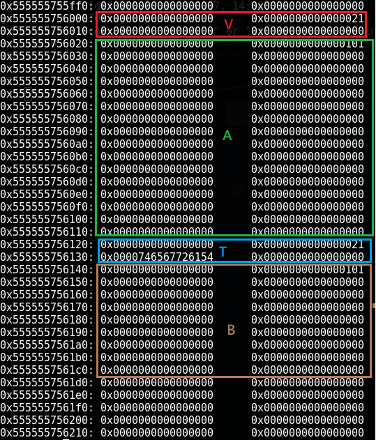
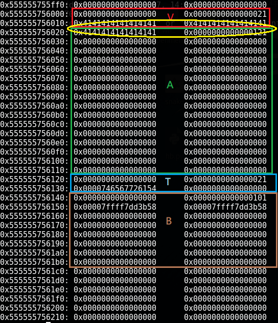
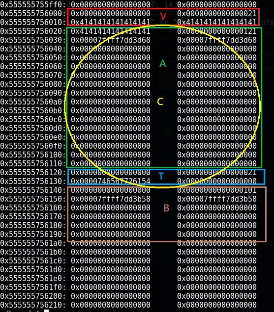
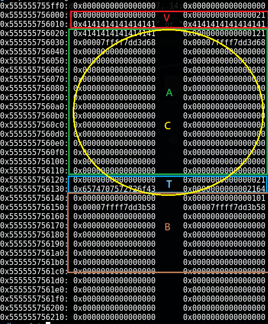

# New Exploit Methods against Ptmalloc of GLIBC

The code and content is obtained from [New Exploit Methods against Ptmalloc of GLIBC](http://ieeexplore.ieee.org/document/7847004/)

This repo is the note I made while read through the paper and run the examples with GDB.

To compile as the example on the paper, we can

```C++
gcc *.c -fpie -pie
```

From the paper: 

The object V represents the vulnerable object and
the object T represents the hypothesized target object. We
prove the success of attack by corrupting the contents of T.

# Code 4: Nonadjacent Free Chunk Consolidation Attack

use [consol_poc1.c](consol_poc1.c)

```C++
	void *V = malloc(0x18); // vulnerable object
	void *A = malloc(0xf0); // chunk size 0x100, not fastbin
	char *T = (char*)malloc(0x10); // target
	void *B = malloc(0xf0); // chunk size 0x100, not fastbin
```


```C++
	free(B);
```







